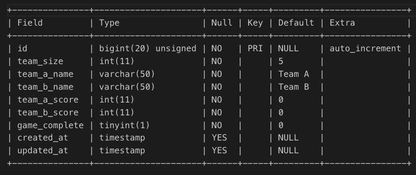
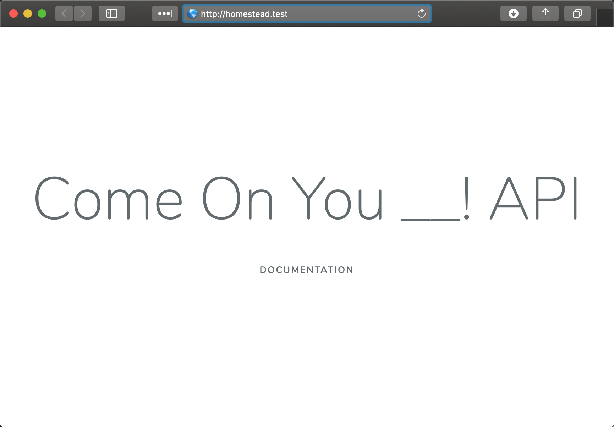

# Come On You __! - Backend

## Front End/Planning Here
https://github.com/nosvalds/come-on-you-team

### DB Structure
#### Table
- matches
  - id
  - team_size
  - team_a_name
  - team_b_name
  - team_a_score
  - team_b_score
  - game_complete
  - timestamps



### API

### Standard Response

- `id`
- `team_size`: integer - number of players on each team
- `teamA`: object - team A object
    - `name`: string - name
    - `score`: string - score
    - `won`: bool - has this team won?
- `teamB`: object - team B object
    - `name`: string - name
    - `score`: string - score
    - `won`: bool - has this team won?
- `game_complete`: bool - is the game over?

### End Points

#### `GET /come-on-you-team/api/matches`

All of the matches that have been played, with the latest match first.

#### `GET /come-on-you-team/api/matches/<id>`

The specified match

#### `POST /come-on-you-team/api/matches`

Save a new match of football

##### Request

- `team_size`: integer - number of players on each team
- `team_a_name`: string - team A name
- `team_b_name`: string - team B name
- `team_a_score`: integer - team A score
- `team_b_score`: integer - team B score
- `game_complete`: bool - is the game complete?


#### `DELETE /come-on-you-team/api/matches/<id>`

<<<<<<< HEAD
Delete a match of football

## Running this Project Yourself:

1. Clone the git repository to your local machine by running the following command in your terminal. Or copy the project folder ( come-on-you-team-db )from google drive to your local machine.
  - Use the ```development``` branch in git to run this project locally. The master branch has specific database setup for deployment to Heroku and will not run locally on a virtual machine

```bash
git clone git@github.com:nosvalds/come-on-you-team.git {project-directory}
```

2. In your terminal cd into the project directory and run the below composer command to install neccessary dependency packages
```bash
cd {project-directory}
composer install
```

3. Set up homestead virtual machine.
- Run the below command in the project directory
```bash
vendor/bin/homestead make
```
- This will create a Homestead.yaml file inside your project directory
  - Inside this file edit the memory to be 512 
    - ```memory: 512``` 

4. Create the .env file
- Run the below command in the project directory
```bash
cp .env.example .env
```
5. Spin up the virtual machine
```bash
vagrant up
```

6. Once the above is complete, ssh into the virtual machine and cd to the code directory
```bash
vagrant ssh
cd code
```

7. Generate the app key, this will be set in your .env file
```bash
art key:generate
```

8. Run the MySQL table migrations to set up the database,
  - You can omit the --seed if you'd like to start with a blank database, otherwise this will seed the database with test data using the ```MatchFactory.php``` and ```MatchSeeder.php```.

```bash
art migrate:fresh --seed
```

9. Navigate to http://homestead.test
- You should see the following homepage which means your virtual machine is up and running!


=======
Delete a game of football
>>>>>>> parent of 389b2f5... Revert DB setup for heroku on development branch, for local testing/development

## Deployment

### Heroku
<<<<<<< HEAD
https://come-on-you-team.herokuapp.com

#### Starting from scratch
1. Sign up for a Heroku account
2. Install the CLI tools and log in from the terminal
  - https://devcenter.heroku.com/articles/getting-started-with-php
  - https://devcenter.heroku.com/categories/command-line
3. Follow these instructions to get deploy the laravel app
  - https://devcenter.heroku.com/articles/getting-started-with-laravel
4. Follow these instructions to get the Database working
  - https://mattstauffer.com/blog/laravel-on-heroku-using-a-mysql-database/
5. You might run into an error with specified key being too long
  - Fix here: https://laravel-news.com/laravel-5-4-key-too-long-error/

#### Deploying updates once setup is done
1. Pull Request and Merge changes from development branch into the master branch
2. Push changes to Heroku
```bash
git push heroku master
``` 

#### Preserving deployment-specific changes in master
- When merging development into master
```bash
git checkout development
git checkout -b development-merge-prep
git revert 389b2f5 # commit that changes DB config for heroku
git checkout Master
git merge Development-merge-prep
```
=======
https://whispering-depths-49610.herokuapp.com/ 

>>>>>>> parent of 389b2f5... Revert DB setup for heroku on development branch, for local testing/development

# Laravel Docs

<p align="center"></p>
<p align="center">
<a href="https://travis-ci.org/laravel/framework"></a>
<a href="https://packagist.org/packages/laravel/framework"></a>
<a href="https://packagist.org/packages/laravel/framework"></a>
<a href="https://packagist.org/packages/laravel/framework"></a>
</p>

## About Laravel

Laravel is a web application framework with expressive, elegant syntax. We believe development must be an enjoyable and creative experience to be truly fulfilling. Laravel takes the pain out of development by easing common tasks used in many web projects, such as:

- [Simple, fast routing engine](https://laravel.com/docs/routing).
- [Powerful dependency injection container](https://laravel.com/docs/container).
- Multiple back-ends for [session](https://laravel.com/docs/session) and [cache](https://laravel.com/docs/cache) storage.
- Expressive, intuitive [database ORM](https://laravel.com/docs/eloquent).
- Database agnostic [schema migrations](https://laravel.com/docs/migrations).
- [Robust background job processing](https://laravel.com/docs/queues).
- [Real-time event broadcasting](https://laravel.com/docs/broadcasting).

Laravel is accessible, powerful, and provides tools required for large, robust applications.

## Learning Laravel

Laravel has the most extensive and thorough [documentation](https://laravel.com/docs) and video tutorial library of all modern web application frameworks, making it a breeze to get started with the framework.

If you don't feel like reading, [Laracasts](https://laracasts.com) can help. Laracasts contains over 1500 video tutorials on a range of topics including Laravel, modern PHP, unit testing, and JavaScript. Boost your skills by digging into our comprehensive video library.

## Laravel Sponsors

We would like to extend our thanks to the following sponsors for funding Laravel development. If you are interested in becoming a sponsor, please visit the Laravel [Patreon page](https://patreon.com/taylorotwell).

### Premium Partners

- **[Vehikl](https://vehikl.com/)**
- **[Tighten Co.](https://tighten.co)**
- **[Kirschbaum Development Group](https://kirschbaumdevelopment.com)**
- **[64 Robots](https://64robots.com)**
- **[Cubet Techno Labs](https://cubettech.com)**
- **[Cyber-Duck](https://cyber-duck.co.uk)**
- **[Many](https://www.many.co.uk)**
- **[Webdock, Fast VPS Hosting](https://www.webdock.io/en)**
- **[DevSquad](https://devsquad.com)**

### Community Sponsors

<a href="https://op.gg"></a>

- [UserInsights](https://userinsights.com)
- [Fragrantica](https://www.fragrantica.com)
- [SOFTonSOFA](https://softonsofa.com/)
- [User10](https://user10.com)
- [Soumettre.fr](https://soumettre.fr/)
- [CodeBrisk](https://codebrisk.com)
- [1Forge](https://1forge.com)
- [TECPRESSO](https://tecpresso.co.jp/)
- [Runtime Converter](http://runtimeconverter.com/)
- [WebL'Agence](https://weblagence.com/)
- [Invoice Ninja](https://www.invoiceninja.com)
- [iMi digital](https://www.imi-digital.de/)
- [Earthlink](https://www.earthlink.ro/)
- [Steadfast Collective](https://steadfastcollective.com/)
- [We Are The Robots Inc.](https://watr.mx/)
- [Understand.io](https://www.understand.io/)
- [Abdel Elrafa](https://abdelelrafa.com)
- [Hyper Host](https://hyper.host)
- [Appoly](https://www.appoly.co.uk)
- [云软科技](http://www.yunruan.ltd/)

## Contributing

Thank you for considering contributing to the Laravel framework! The contribution guide can be found in the [Laravel documentation](https://laravel.com/docs/contributions).

## Code of Conduct

In order to ensure that the Laravel community is welcoming to all, please review and abide by the [Code of Conduct](https://laravel.com/docs/contributions#code-of-conduct).

## Security Vulnerabilities

If you discover a security vulnerability within Laravel, please send an e-mail to Taylor Otwell via [taylor@laravel.com](mailto:taylor@laravel.com). All security vulnerabilities will be promptly addressed.

## License

The Laravel framework is open-sourced software licensed under the [MIT license](https://opensource.org/licenses/MIT).
